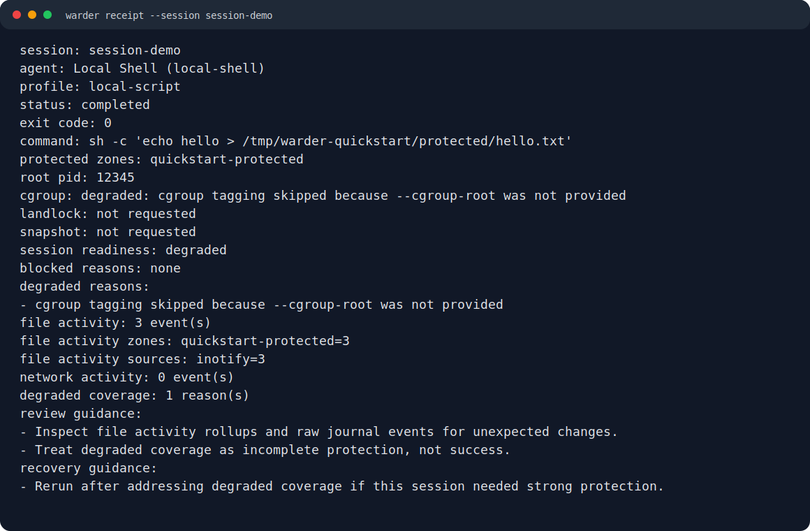

<p align="center">
  
</p>

[](https://github.com/betnbd/warder/actions/workflows/ci.yml)
[](https://github.com/betnbd/warder/releases)
[](LICENSE)
[](#current-status)

Warder is an alpha Linux supervised-session tool for running local AI agents with protected zones, write-blocking where the host supports it, and readable receipts.

It lets you declare protected folders, launch an agent through Warder, and get a receipt that explains what the session was allowed to do, what Warder observed, which protections were active, and where host support was missing.

The first goal is practical: keep permissive local agent workflows fast while making personal data, credentials, important projects, and core system paths harder to damage.

## Start Here

- New user: read [Quick Start](#quick-start), then [Protected Zones](docs/protected-zones.md).
- Installing an alpha build: read [Install Notes](docs/install.md) and [Release Trust Model](docs/release-trust.md).
- Reviewing the alpha: read [Reviewer Feedback Guide](docs/reviewer-feedback.md).
- Evaluating the safety model: read [Security Model](docs/security-model.md) and [Threat Model](THREAT_MODEL.md).
- Looking for the project direction: read [Product Overview](PRODUCT_SPEC.md), [Vision](docs/vision.md), and [Roadmap](ROADMAP.md).
- Looking for common scenarios: read [Examples](docs/examples/README.md) and [FAQ](docs/FAQ.md).

## Why Use It

Local AI agents often run with the same permissions as you. That is convenient, but it also means an agent can modify files, touch credentials, or make network calls unless something outside the agent draws a boundary.

Warder gives you one tool-agnostic place to define that boundary.

- Protect folders such as projects, notes, SSH keys, cloud credentials, or `.env` files.
- Run Codex CLI, Claude Code, Goose, local scripts, or another command under the same policy model.
- Preview a session before launch with `explain` and `dry-run`.
- Deny writes to protected paths where Linux Landlock is available.
- Snapshot supported Btrfs roots before risky sessions.
- Review a plain-language receipt and file/network journal after the run.
- See degraded protections called out instead of hidden.

## Current Status

Warder is an alpha Linux tool with a working CLI and native desktop app.

The CLI can initialize config, dry-run a policy, launch a supervised command, persist session receipts, record observed file activity, read back network-journal data, and report degraded enforcement. Landlock write denial, cgroup tagging, inotify file journaling, Btrfs snapshots, guarded Btrfs revert, and optional live eBPF network collection are implemented where the host supports them.

It is not an always-on system guard. Warder only supervises commands launched through Warder.

## Known Limits

- Warder only supervises processes launched through `warder run`.
- Host support matters: missing Landlock, cgroups, Btrfs, or eBPF permissions can reduce protection.
- Protected reads are visible policy notes in v1; Warder does not block reads yet.
- Current network journaling is visibility, not complete network enforcement.
- Local receipts and journals are useful accountability records, not tamper-proof forensics.
- Alpha packages are checksummed and attested where available, but they are not package-manager signed.

## Quick Start

From a source checkout, run the lowest-friction smoke test:

```bash
scripts/quickstart-demo.sh
```

The demo creates a throwaway protected folder under `/tmp/warder-quickstart`, launches a supervised shell command, then prints the receipt and file journal. It intentionally skips delegated cgroup setup, so you should see one degraded protection reason while still seeing observed protected-zone activity.

Create your own starter config:

```bash
warder init \
  --output warder.toml \
  --profile local-script \
  --agent-command sh \
  --protected-path /absolute/path/to/protect

warder explain --config warder.toml
warder dry-run --config warder.toml --agent local-script -- sh -c 'true'
```

`warder init` refuses to overwrite an existing file unless `--force` is passed. Use `--print` to preview generated config without writing it.

Launch a supervised session:

```bash
warder run --config warder.toml --launch --accept-degraded --agent local-script -- sh -c 'echo test'
```

`--accept-degraded` is required when the launch readiness check finds incomplete protection, such as missing delegated cgroups, unavailable snapshots, or visibility-only eBPF journaling. Omit it when you want Warder to refuse degraded launches.

Review the result:

```bash
warder receipt --db .warder/warder.db --session <session-id>
warder journal --db .warder/warder.db --session <session-id> --file
```

## Desktop App

The native Linux desktop app lives in `apps/desktop`. It helps create a Warder config, launch supervised sessions, and review receipts and journals.

The GUI requires at least one protected path before saving setup or launching. New setups default to strict write-block launch, and best-effort launch is an explicit toggle for reviewers who accept degraded protection on hosts without usable Landlock support. The GUI requires a fresh launch-readiness review before the run button is enabled, and the Rust launch command refuses desktop launches that do not carry that review acknowledgement.

Development launch:

```bash
cd apps/desktop
npm ci
npm run tauri -- dev
```

Release builds produce the CLI, GUI binary, `.deb`, RPM, AppImage, `SHA256SUMS`, and `release-manifest.json`. See [Install Notes](docs/install.md) and [Release Trust Model](docs/release-trust.md) before installing alpha packages.

## What Warder Protects

Warder works around protected zones: named groups of paths plus policy.

Common protected zones include:

- credential folders such as `~/.ssh`, `~/.gnupg`, `~/.aws`, `~/.config/gcloud`, and Kubernetes config
- private notes or personal documents
- projects that should be read-only to an agent
- repositories that should be snapshot-backed before a risky session
- config files that should not be changed by unattended commands

See [Protected Zones](docs/protected-zones.md) for examples and policy guidance.

## What To Expect From Receipts

A Warder receipt summarizes:

- the agent label and command that ran
- active and degraded protections
- protected-zone policy
- exit status
- observed file activity
- network-journal coverage and known limits
- snapshot and recovery state
- suggested review actions

Receipts are designed to stay useful even when some enforcement is degraded. If a kernel feature, filesystem feature, privilege, or explicit root is missing, Warder reports that directly.



The text version of this example lives at [docs/examples/sample-receipt.txt](docs/examples/sample-receipt.txt).

## Examples

- [Protect credentials while running a coding agent](docs/examples/protect-credentials.md)
- [Give an agent read-only access to notes](docs/examples/readonly-notes.md)
- [Run risky project edits with snapshots](docs/examples/snapshot-project.md)
- [Run OpenClaw through Warder](docs/examples/openclaw.md)

## Security Model

Warder does not depend on an agent choosing to behave. The project prefers host controls such as Landlock, cgroups, snapshots, file journals, and eBPF-backed observation where available.

Important limits:

- Warder only supervises processes launched through `warder run`.
- Unsupported kernels and filesystems reduce enforcement.
- Current network visibility is limited, not complete socket forensics.
- Alpha packages are checksummed and attested where available, but they are not package-manager signed.
- No local safety tool can make arbitrary permissive execution risk-free.

Read [Security Model](docs/security-model.md), [Threat Model](THREAT_MODEL.md), and [Permissions](docs/permissions.md) before relying on Warder for sensitive work.

## Common Commands

```text
warder init --protected-path <path> [--output <path>] [--profile <id>] [--agent-command <command>] [--force] [--print]
warder explain --config <path>
warder dry-run --config <path> --agent <id> -- <agent command>
warder run --config <path> --launch --agent <id> [--require-enforcement] [--accept-degraded] [--cgroup-root <path>] [--snapshot-root <path>] -- <agent command>
warder receipt [--db <path>] --session <id> [--format text|json] [--signing-key-file <path>] [--verify-signature <hex>]
warder receipt-key init [--output <path>] [--force]
warder journal [--db <path>] [--file|--network|--all] [--session <id>]
warder snapshot --config <path> --session <id> --snapshot-root <path>
warder revert --snapshot <id> --snapshot-root <path> [--preview | --db <path> --session <id>]
warder doctor
warder profiles [--format text|json]
warder status
```

## Build From Source

```bash
cargo build --release -p warder-cli --bin warder
```

Full workspace validation:

```bash
cargo fmt --check
cargo clippy --workspace --all-targets -- -D warnings
cargo test --workspace
scripts/quickstart-demo.sh
scripts/profile-template-demo.sh
scripts/prototype-demo.sh
```

Desktop release build:

```bash
cd apps/desktop
npm ci
npm run build
npm test
npm run tauri -- build --bundles deb,rpm,appimage --ci
```

## Documentation

- [Documentation Guide](docs/README.md)
- [Vision](docs/vision.md)
- [Product Overview](PRODUCT_SPEC.md)
- [FAQ](docs/FAQ.md)
- [Examples](docs/examples/README.md)
- [Install Notes](docs/install.md)
- [Reviewer Feedback Guide](docs/reviewer-feedback.md)
- [Release Trust Model](docs/release-trust.md)
- [Release Readiness](docs/release-readiness.md)
- [Protected Zones](docs/protected-zones.md)
- [Security Model](docs/security-model.md)
- [Threat Model](THREAT_MODEL.md)
- [Permissions](docs/permissions.md)
- [Architecture](docs/architecture.md)
- [Receipts And Journals](docs/audit-log.md)
- [Prototype Demo](docs/prototype-demo.md)
- [MVP Scope](MVP_SCOPE.md)
- [Roadmap](ROADMAP.md)

## Repository Layout

- `crates/cli`: command-line app
- `crates/config`: config loading and validation
- `crates/policy`: protected-zone policy model
- `crates/enforcement`: Linux enforcement boundary
- `crates/snapshot`: snapshot and revert support
- `crates/journal`: file and network journal handling
- `crates/db`: SQLite persistence
- `apps/desktop`: native Linux desktop app
- `docs/`: user, security, architecture, install, and release notes

## License

MIT. See [LICENSE](LICENSE).
